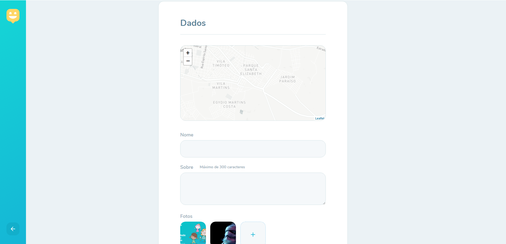

# Happy

Happy é uma aplicação desenvolvida durante a Next Level Week 3 da Rocketseat

## Tecnologias utilizadas

-   ReactJS

-   Typescript

## Tela inicial

## Mapa de orfanatos

## Cadastro de orfanatos

## Backend

https://github.com/maatheusgouveia/nlw3-happy-backend
